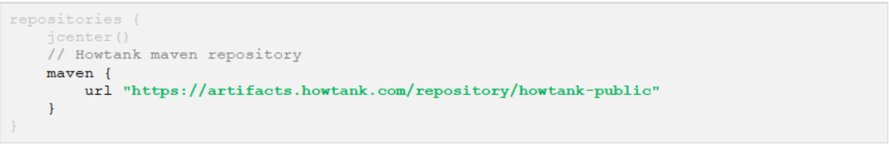

# Howtank Widget Demo App

## Latest version: 1.4.7

### Technical overview
- The Howtank Android widget is a library that, once included in your app, display the Howtank chat. Before being clicked by the user, it is in a "folded" state, waiting quietly for a user action.
- Once clicked by the user, it switches to the "expanded" state, exchanging chat data with Howtank servers.
- The widget is very lightweight to preserve your application.

</br>

### Demo
- You can download a (technical) demo application here:
http://cdn.howtank.com/sdk/android/HowtankWidgetSample-1.0.0.zip
- The demo application contains all the code you need to get started with the chat widget. You might refer to the following documentation for further information.
- To install the application, just open the project with Android Studio and run the application.
- Please read the content of the `MainActivity.kt` file. It is fully documented and explain how to set up and run the widget.

### Installation guide
>**Gradle configuration**

- Gradle is the official build system for Android Studio. See more information here: http://gradle.org/getting-started-android/
First, you need to add a new repository in your main `build.gradle` file:



Then, in your app `build.gradle` file, add the following dependency:

```
dependencies {
    ...
    implementation 'com.google.code.gson:gson:2.10'
    implementation "androidx.dynamicanimation:dynamicanimation:1.0.0"
    implementation 'com.howtank.widget:howtankwidget:1.4.7'
}
```
Create file `network_security_config.xml` in the folder `res/xml` and input the following content:

```
<?xml version="1.0" encoding="utf-8"?>
<network-security-config>
  <domain-config cleartextTrafficPermitted="true">
    <domain includeSubdomains="true">www.howtank.com</domain>
  </domain-config>
</network-security-config>
```

In `AndroidManifest.xml`, add following attribute to application tag:
```
<?xml version="1.0" encoding="utf-8"?>
<manifest ... >
    <application android:networkSecurityConfig="@xml/network_security_config"
                    ... >
        ...
    </application>
</manifest>
```

</br>

>**Widget initialization**
- To get the HowtankWidget up and running, you need to add the following lines in your main Activity class, within the `onCreate` method:

```
 // Add Howtank Widget
HowtankWidget.getInstance().init(this, "HOST_ID");
```

***Where***
Name | Description | Mandatory?
--- | --- | ---
this | Your activity context | YES 
**HOST_MNEMONIC** | Your identifier (given by Howtank team) | YES 


</br>

>**Activities configuration**

You might want to display the widget on some activities (or fragments) and not on some others, or display the widget everywhere in your app. In any case, you **need** to call the following method within all your activities’ onResume function:

```
 // Howtank Widget specific configuration
HowtankWidget.getInstance().browse(this, SHOW_WIDGET, "PAGE_NAME", "PAGE_URL");
```
</br>

***Where***
Name | Description | Mandatory?
--- | --- | ---
this | Your activity context </br> If you’re calling this method through a fragment, you should use getActivity() | YES 
**SHOW_WIDGET** | boolean, if the widget should be displayed `true` on this activity Yes or not `false` | YES 
**PAGE_NAME** | String, the name of the current activity (ie. `Product page` or `Product – Apple iPhone`). This information will be read by your community member when taking a chat, so the more precise the better. | YES 
**PAGE_URL** | String, a URL representation of your current page. Most apps use URLs for deeplinking. Again, this url will be clickable by members, so they can have a precise view of what the user is watching. </br> Examples are : http://www.mywebsite.com/product/1234 or myapp://product/1234 | YES 

That’s all! The Howtank Widget should appear on the bottom-right end corner of your application. Please note that it might take a few seconds since we query our servers to decide whether or not the widget should be displayed.


### Advanced configuration

- Default configuration gets the widget running in a few lines of code. However, you can overload it with the following parameters.
- Please note that `init` should always be called last.

</br>

>**Example**
```
HowtankWidget.getInstance() .setVerboseOn(true)
        .init(this, "HOST_MNEMONIC");
```

</br>

>**Verbose mode**
```
setVerboseOn(true|false)
```
Enable more detailed logs when something went wrong. Only sets this to true in debug mode when debugging with the Howtank team.


</br>

### Adding a handler

You can set a `HowtankWidgetHandler` before calling the init method:

```
HowtankWidget.getInstance()
.setHandler(new HowtankWidgetHandler() {
            @Override
            public void didSelectLink(String link) { ... }
}).init(this, "HOST_MNEMONIC");
```

The following methods will be called when specific actions occur:

</br>

>**Selected link**
```
public void onLinkSelected(String link) {
    // Handle the clicked link
}
```

When user click on the link in the chat, this method is called so you can handle the clicked link properly. By default, nothing happens when user clicks on a link.

</br>

>**Widget unavailable**

```
public void widgetUnavailable(String reason) {
    // Called when the widget is unavailable
}
```

When the widget is unavailable, this method is called with the reason.

</br>

>**Widget events**

```
public void widgetEvent(HowtankWidgetEvent event) {
    // Called when a specific widget event occurs
}
```

This method is called when a specific event is triggered, usually by the user. The following events may be triggered:

Event name | Description 
--- | ---
**INITIALIZED** | When the widget has been correctly initialized and the chat is active
**OPENED** | Triggered when the user clicks on the chat bubble
**DISABLED** | When the chat bubble has been dragged and released over the deletion area
**MOVE** | When the chat bubble has been moved by the user
**DISPLAYED** | When the widget bubble is displayed
**HIDDEN** | When the widget bubble is hidden
              
### Conversion tracker integration

You can track 2 types of goals: generic and purchases.

> **Generic goal tracking**

The following tracker has to be called on activities where the goals you want to track are achieved:
```
HowtankWidget.getInstance().conversion("GOAL_NAME")
```

***Where***
Name | Description | Mandatory?
--- | --- | ---
**GOAL_NAME** | String, the name of the goal you want to track. </br> You can have several goals (e.g. purchase, registration, subscription, etc.). </br> Our platform will automatically generate a report for each goal tracked. | YES 


> **Purchase**

This specific tracker allows you to provide more information about purchases:

```
final HTPurchaseParameters purchaseParameters = new HTPurchaseParameters()
purchaseParameters.setNewBuyer(IS_NEW_BUYER);
purchaseParameters.setPurchaseId("PURCHASE_ID");
purchaseParameters.setValueAmount(VALUE_AMOUNT);
purchaseParameters.setValueCurrency("VALUE_CURRENCY");
// Send the purchase conversion tag
HowtankWidget.getInstance().conversion("GOAL_NAME", purchaseParameters)
```

***Where***
Name | Description | Mandatory?
--- | --- | ---
**GOAL_NAME** | **String**, the name of the goal you want to track. </br> You can have several goals (e.g. purchase, registration, subscription, etc.). </br> Our platform will automatically generate a report for each goal tracked. | YES 
**IS_NEW_BUYER** | `true` : this is the first purchase of this user </br> `false` : this user is a returning customer | YES
**PURCHASE_ID** | **String**, identifier of the purchase in your system | YES
VALUE_CURRENCY | ISO Currency code string (eg. `USD`, `EUR`, `GBP`, etc.) | YES
